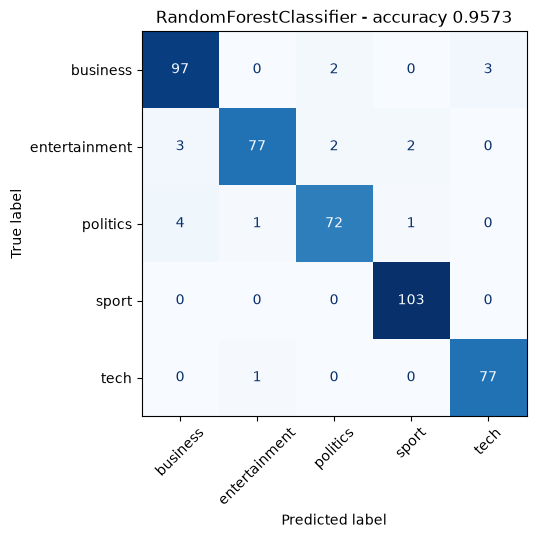

# run_pipeline.py

## Summary

| field | value |
| --- | --- |
| document_count | 2225 |
| target_names | business, entertainment, politics, sport, tech |
| train_size | 1780 |
| test_size | 445 |
| feature_count | 1500 |

## Metrics

| | precision | recall | f1-score | support |
| --- | --- | --- | --- | --- |
| business | 0.9327 | 0.9510 | 0.9417 | 102 |
| entertainment | 0.9747 | 0.9167 | 0.9448 | 84 |
| politics | 0.9474 | 0.9231 | 0.9351 | 78 |
| sport | 0.9717 | 1.0000 | 0.9856 | 103 |
| tech | 0.9625 | 0.9872 | 0.9747 | 78 |
| macro avg | 0.9578 | 0.9556 | 0.9564 | 445 |
| weighted avg | 0.9574 | 0.9573 | 0.9571 | 445 |

- accuracy: 0.9573

## Figures

### Confusion matrix



## Config

<details><summary>as declared</summary>

```json
{
  "initialize": {
    "source": "examples/bbc-news-classification/data/raw/bbc",
    "extension": ".txt",
    "type": "text-document"
  },
  "cleanse": {
    "char_cleaner_function": {
      "module": "aistudio.data.text_utils",
      "object": "clear_default_chars"
    },
    "stemming_lemmatization_function": {
      "module": "aistudio.data.text_utils",
      "object": "stemming_lematization"
    },
    "stemmer_or_lemmatizer_instance": {
      "module": "snowballstemmer",
      "object": "stemmer",
      "hyper_params": {
        "lang": "english"
      }
    }
  },
  "prepare": {
    "vectorizer_instance": {
      "module": "sklearn.feature_extraction.text",
      "object": "CountVectorizer",
      "hyper_params": {
        "max_features": 1500,
        "min_df": 5,
        "max_df": 0.7
      },
      "stop_words": {
        "module": "sklearn.feature_extraction.text",
        "object": "ENGLISH_STOP_WORDS"
      }
    },
    "transformer_instance": {
      "module": "sklearn.feature_extraction.text",
      "object": "TfidfTransformer"
    },
    "test_size": 0.2,
    "random_state": 0
  },
  "execute": {
    "model_instance": {
      "module": "sklearn.ensemble",
      "object": "RandomForestClassifier",
      "hyper_params": {
        "n_estimators": 500,
        "random_state": 0
      }
    }
  }
}
```

</details>
