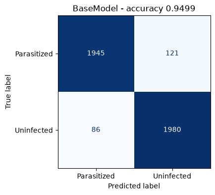
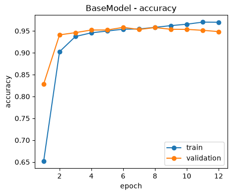
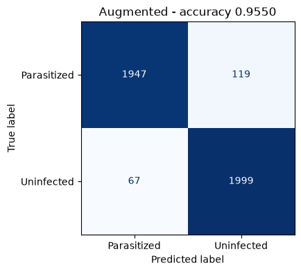
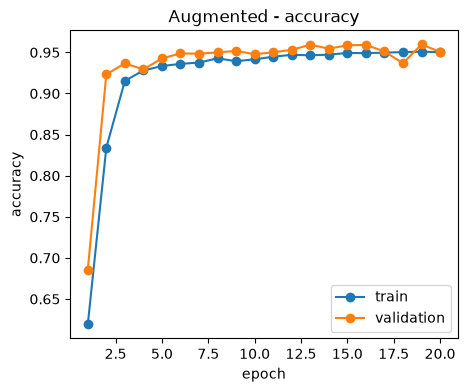
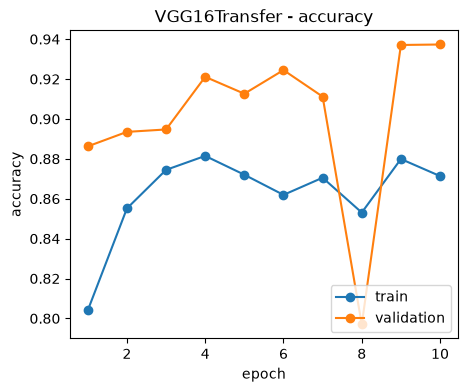

# run_pipeline.py

## Summary

| field | value |
| --- | --- |
| class_names | Parasitized, Uninfected |
| train_images | 19294 |
| validation_images | 4132 |
| test_images | 4132 |

## Models

| | accuracy | loss | parameters | epochs |
| --- | --- | --- | --- | --- |
| BaseModel | 0.9499 | 0.1571 | 8398818 | 12 |
| Augmented | 0.9550 | 0.1349 | 8398818 | 20 |
| VGG16Transfer | 0.9221 | 0.2133 | 1801794 | 10 |

## Figures

### BaseModel confusion matrix



### BaseModel training history



### Augmented confusion matrix



### Augmented training history



### VGG16Transfer confusion matrix


### VGG16Transfer training history



## Config

<details><summary>as declared</summary>

```json
{
  "initialize": {
    "source": "examples/malaria-detection/data/raw/cell_images",
    "image_size": [
      64,
      64
    ],
    "batch_size": 32,
    "validation_split": 0.15,
    "test_split": 0.15,
    "seed": 35
  },
  "models": {
    "BaseModel": {
      "layers": [
        {
          "module": "tensorflow.keras.layers",
          "object": "Rescaling",
          "hyper_params": {
            "scale": 0.00392156862745098
          }
        },
        {
          "module": "tensorflow.keras.layers",
          "object": "Conv2D",
          "hyper_params": {
            "filters": 32,
            "kernel_size": 2,
            "padding": "same",
            "activation": "relu"
          }
        },
        {
          "module": "tensorflow.keras.layers",
          "object": "MaxPooling2D",
          "hyper_params": {
            "pool_size": 2
          }
        },
        {
          "module": "tensorflow.keras.layers",
          "object": "Dropout",
          "hyper_params": {
            "rate": 0.2
          }
        },
        {
          "module": "tensorflow.keras.layers",
          "object": "Conv2D",
          "hyper_params": {
            "filters": 64,
            "kernel_size": 2,
            "padding": "same",
            "activation": "relu"
          }
        },
        {
          "module": "tensorflow.keras.layers",
          "object": "MaxPooling2D",
          "hyper_params": {
            "pool_size": 2
          }
        },
        {
          "module": "tensorflow.keras.layers",
          "object": "Dropout",
          "hyper_params": {
            "rate": 0.2
          }
        },
        {
          "module": "tensorflow.keras.layers",
          "object": "Flatten"
        },
        {
          "module": "tensorflow.keras.layers",
          "object": "Dense",
          "hyper_params": {
            "units": 512,
            "activation": "relu"
          }
        },
        {
          "module": "tensorflow.keras.layers",
          "object": "Dropout",
          "hyper_params": {
            "rate": 0.4
          }
        },
        {
          "module": "tensorflow.keras.layers",
          "object": "Dense",
          "hyper_params": {
            "units": 2,
            "activation": "softmax"
          }
        }
      ],
      "compile": {
        "loss": "categorical_crossentropy",
        "optimizer": {
          "module": "tensorflow.keras.optimizers",
          "object": "Adam",
          "hyper_params": {
            "learning_rate": 0.001
          }
        },
        "metrics": [
          "accuracy"
        ]
      },
      "fit": {
        "epochs": 20,
        "verbose": 2,
        "shuffle": false,
        "callbacks": [
          {
            "module": "tensorflow.keras.callbacks",
            "object": "EarlyStopping",
            "hyper_params": {
              "monitor": "val_loss",
              "patience": 4,
              "restore_best_weights": true
            }
          }
        ]
      }
    },
    "Augmented": {
      "layers": [
        {
          "module": "tensorflow.keras.layers",
          "object": "Rescaling",
          "hyper_params": {
            "scale": 0.00392156862745098
          }
        },
        {
          "module": "tensorflow.keras.layers",
          "object": "RandomFlip",
          "hyper_params": {
            "mode": "horizontal_and_vertical"
          }
        },
        {
          "module": "tensorflow.keras.layers",
          "object": "RandomRotation",
          "hyper_params": {
            "factor": 0.2
          }
        },
        {
          "module": "tensorflow.keras.layers",
          "object": "RandomZoom",
          "hyper_params": {
            "height_factor": 0.1
          }
        },
        {
          "module": "tensorflow.keras.layers",
          "object": "Conv2D",
          "hyper_params": {
            "filters": 32,
            "kernel_size": 2,
            "padding": "same",
            "activation": "relu"
          }
        },
        {
          "module": "tensorflow.keras.layers",
          "object": "MaxPooling2D",
          "hyper_params": {
            "pool_size": 2
          }
        },
        {
          "module": "tensorflow.keras.layers",
          "object": "Dropout",
          "hyper_params": {
            "rate": 0.2
          }
        },
        {
          "module": "tensorflow.keras.layers",
          "object": "Conv2D",
          "hyper_params": {
            "filters": 64,
            "kernel_size": 2,
            "padding": "same",
            "activation": "relu"
          }
        },
        {
          "module": "tensorflow.keras.layers",
          "object": "MaxPooling2D",
          "hyper_params": {
            "pool_size": 2
          }
        },
        {
          "module": "tensorflow.keras.layers",
          "object": "Dropout",
          "hyper_params": {
            "rate": 0.2
          }
        },
        {
          "module": "tensorflow.keras.layers",
          "object": "Flatten"
        },
        {
          "module": "tensorflow.keras.layers",
          "object": "Dense",
          "hyper_params": {
            "units": 512,
            "activation": "relu"
          }
        },
        {
          "module": "tensorflow.keras.layers",
          "object": "Dropout",
          "hyper_params": {
            "rate": 0.4
          }
        },
        {
          "module": "tensorflow.keras.layers",
          "object": "Dense",
          "hyper_params": {
            "units": 2,
            "activation": "softmax"
          }
        }
      ],
      "compile": {
        "loss": "categorical_crossentropy",
        "optimizer": {
          "module": "tensorflow.keras.optimizers",
          "object": "Adam",
          "hyper_params": {
            "learning_rate": 0.001
          }
        },
        "metrics": [
          "accuracy"
        ]
      },
      "fit": {
        "epochs": 20,
        "verbose": 2,
        "shuffle": false,
        "callbacks": [
          {
            "module": "tensorflow.keras.callbacks",
            "object": "EarlyStopping",
            "hyper_params": {
              "monitor": "val_loss",
              "patience": 4,
              "restore_best_weights": true
            }
          }
        ]
      }
    },
    "VGG16Transfer": {
      "base_model": {
        "module": "tensorflow.keras.applications",
        "object": "VGG16",
        "hyper_params": {
          "weights": "imagenet",
          "include_top": false,
          "input_shape": [
            64,
            64,
            3
          ]
        }
      },
      "base_layer": "block3_pool",
      "base_trainable": false,
      "input_layers": [
        {
          "module": "preprocessing",
          "object": "VGGPreprocessing"
        }
      ],
      "layers": [
        {
          "module": "tensorflow.keras.layers",
          "object": "GlobalAveragePooling2D"
        },
        {
          "module": "tensorflow.keras.layers",
          "object": "Dense",
          "hyper_params": {
            "units": 256,
            "activation": "relu"
          }
        },
        {
          "module": "tensorflow.keras.layers",
          "object": "Dropout",
          "hyper_params": {
            "rate": 0.3
          }
        },
        {
          "module": "tensorflow.keras.layers",
          "object": "Dense",
          "hyper_params": {
            "units": 2,
            "activation": "softmax"
          }
        }
      ],
      "compile": {
        "loss": "categorical_crossentropy",
        "optimizer": {
          "module": "tensorflow.keras.optimizers",
          "object": "Adam",
          "hyper_params": {
            "learning_rate": 0.001
          }
        },
        "metrics": [
          "accuracy"
        ]
      },
      "fit": {
        "epochs": 20,
        "verbose": 2,
        "shuffle": false,
        "callbacks": [
          {
            "module": "tensorflow.keras.callbacks",
            "object": "EarlyStopping",
            "hyper_params": {
              "monitor": "val_loss",
              "patience": 4,
              "restore_best_weights": true
            }
          }
        ]
      }
    }
  }
}
```

</details>
